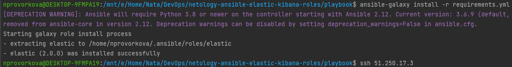
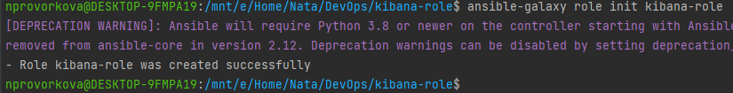
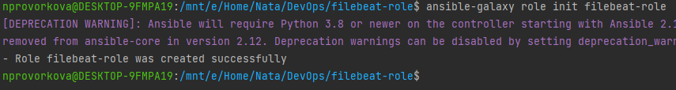

### 8.4 Работа с Roles - Наталия Проворкова
###### 1. Создать в старой версии playbook файл requirements.yml и заполнить его следующим содержимым:
---
  - src: git@github.com:netology-code/mnt-homeworks-ansible.git
    scm: git
    version: "2.0.0"
    name: elastic 
#### 2. При помощи ansible-galaxy скачать себе эту роль.

#### 3. Создать новый каталог с ролью при помощи ansible-galaxy role init kibana-role.

###### 4. На основе tasks из старого playbook заполните новую role. Разнесите переменные между vars и default.
###### 5. Перенести нужные шаблоны конфигов в templates.
#### 6. Создать новый каталог с ролью при помощи ansible-galaxy role init filebeat-role.

###### 7. На основе tasks из старого playbook заполните новую role. Разнесите переменные между vars и default.
###### 8. Перенести нужные шаблоны конфигов в templates.
###### 9. Описать в README.md обе роли и их параметры.
#### 10. Выложите все roles в репозитории. Проставьте тэги, используя семантическую нумерацию.
###### 11. Добавьте roles в requirements.yml в playbook.
###### 12. Переработайте playbook на использование roles.
###### 13. Выложите playbook в репозиторий.
###### 14. В ответ приведите ссылки на оба репозитория с roles и одну ссылку на репозиторий с playbook.